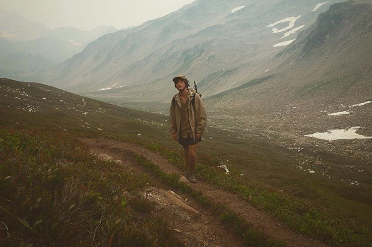
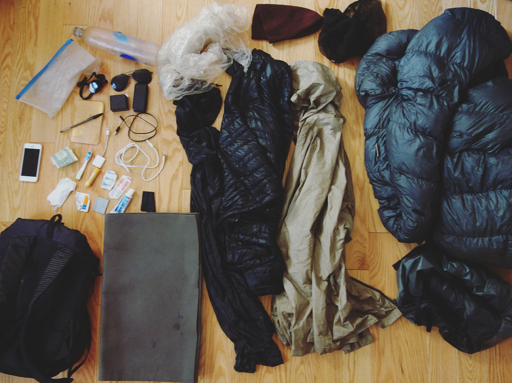
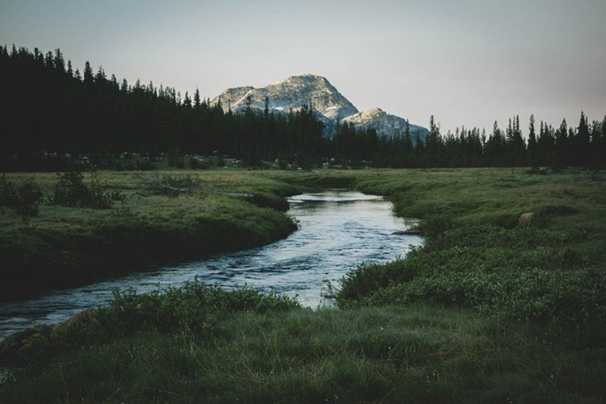
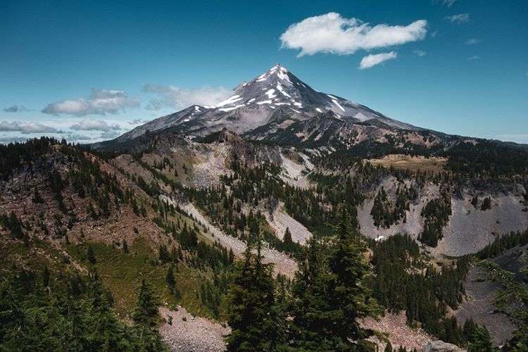

[//]: # (Date)

## A Walk Along the Pacific Crest Trail

<small><i>March 25, 2021</i></small>

### An Opportunity

In 2018, I had the opportunity to spend a summer <i>en plein air</i> hiking the length of the Pacific Crest Trail. And what an incredible opportunity it was.

Much has been written already by the thousands of individuals who have completed this 2,700 mile journey, so if you would like to become familiar with the trail in general, I encourage you to see the resources at the end.

### Before the West

I hiked the 2,200 mile Appalachian Trail in 2017.
As was the case for many to whom the trail beckons, I sought something shake myself out of any form of complacency. Complacency. Death before dying.

The motiviations for hiking are simple to articulate. The physical and mental benefits of constant physical exertion, the awe of nature, and the diversity of days leave little question in answering "why". However. Taking an absence of months from work, not having ties requiring attention through the duration - these attributes ensure that thru-hiking, and extended travel in general - are a privileged activity.

### Why

As was the case for many to whom the trail beckons, I sought something shake myself out of any form of complacency. Complacency. Death before dying.

The motiviations for hiking are simple to articulate. The physical and mental benefits of constant physical exertion, the awe of nature, and the diversity of days leave little question in answering "why". However. Taking an absence of months from work, not having ties requiring attention through the duration - these attributes ensure that thru-hiking, and extended travel in general - are a privileged activity.

### The Golden State

Before arriving in San Diego Airport, I had never been the the West coast. Growing up in New England, I had envisioned California as natural coastal beauty, Pulp Fiction, and Silicon Valley.

Walking outside for the first time, the air felt different in my lungs - drier, lighter, than back in Connecticut. I am sure I was imagining it.

From San Diego to the Mexican border, from the border to Canada. 700 miles of gorgeous desert hiking.

I remeber the first night out of Campo underestimating water and being thirsty, then waking up the following morning to frost over my sleeping bag on the ground.

### Oregon

<!--  -->

### Wildfires

Looking back on the orange-smoke permated photos, it is a great wonder I didn't leave earlier for the sake of my lungs (as I probably should have done).

### Reflecting

So I hope to complete this one. Rainy Pass to Manning Park, 60 miles. I am nearly grateful that it did not work out last time, so that I have an excuse to return. And this time with someone else.

## Further Reading

- <a href="#">Short film of the 2018 hike</a>